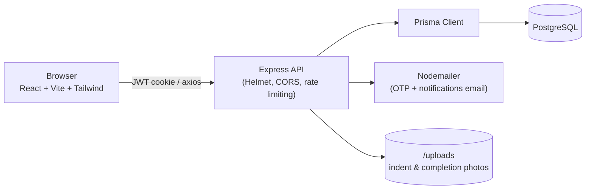
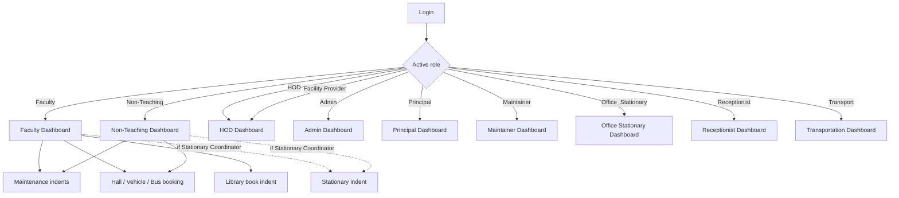
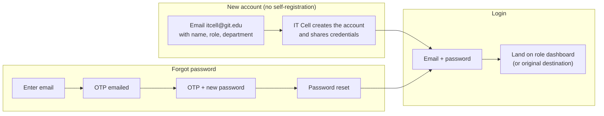
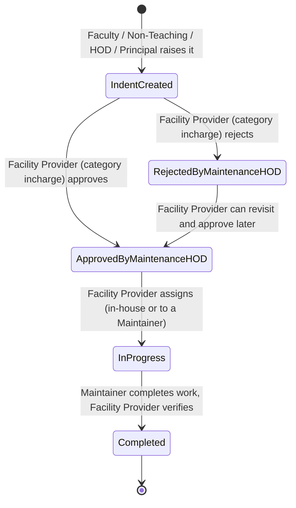
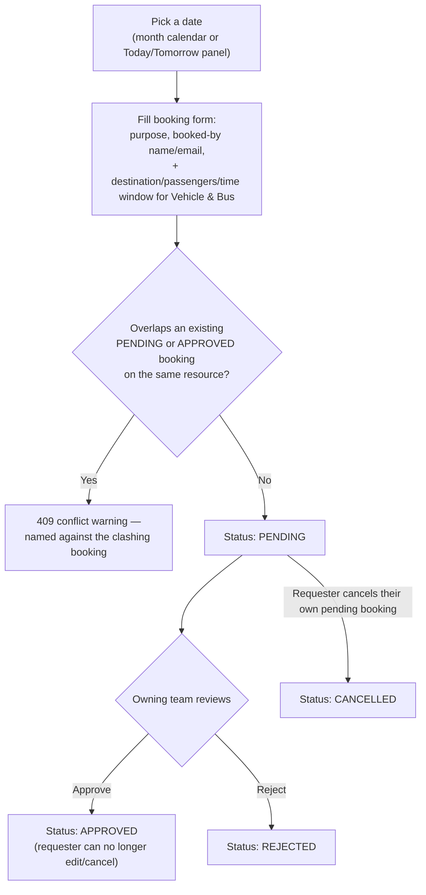
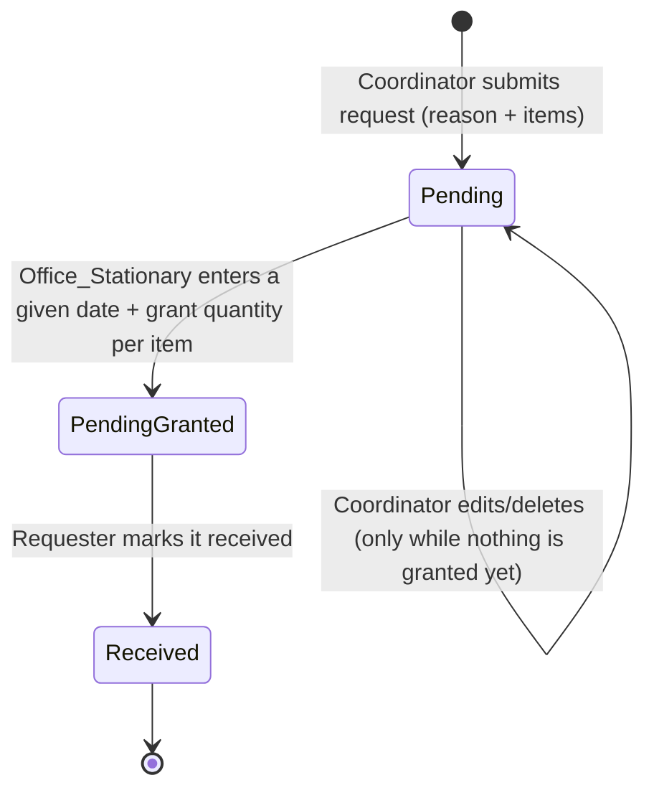

# GIT Maintenance & Indent Management System — Project Overview

A single, current reference for what this system does and exactly how each role moves through it, end to end — with diagrams for demoing the flow to end users. For the stationery workflow specifically, see [STATIONARY_MODULE.md](STATIONARY_MODULE.md).

---

## 1. What the system does

A college-wide web app used to run several request-and-approval workflows behind one login:

- **Maintenance indents** — report a facility/IT problem or request new work, route it through the category's Facility Provider for approval, assign it to a maintainer, and track it to completion.
- **Resource bookings** — reserve halls, vehicles, and buses on a shared calendar, approved by the team that owns that resource.
- **Library book indents** — faculty request books; a designated Library HOD can view every request in one place (no approve/reject/order workflow yet).
- **Stationery indents** — departments request stationery items; Office_Stationary fulfills them.
- Shared across all of the above: OTP-verified registration/login, role-based dashboards, in-app notifications, and Excel/PDF reporting.

**Stack:** React (Vite) + Tailwind frontend talking to an Express/Prisma (PostgreSQL) backend over JWT-authenticated REST calls; Nodemailer sends OTP emails, Multer handles photo uploads.

The same backend process serves both a plain-HTTP internal-IP origin and an HTTPS domain (`indents.git.edu`) behind a reverse proxy — `trust proxy` and an explicit allow-list handle both origins at once.

---

## 2. Roles in the system

| Role | What they're for |
|---|---|
| **Faculty** | Raises maintenance indents, books halls/vehicles/buses, requests library books; may also handle stationery if designated Stationary Coordinator |
| **Non-Teaching** | Same as Faculty, minus library book requests |
| **HOD** | Does *not* approve or reject indents — that sits with the Facility Provider. Can still assign an existing Maintainer to an already-approved indent; manages Stationary Coordinators; the Library HOD also manages library branches and views submitted book indents (read-only) |
| **Facility Provider** | The role that approves or rejects maintenance indents for categories they're incharge of, and runs the Maintenance Queue; is the *only* role that adds/removes department staff as Maintainer — HOD can view and assign maintainers but not add/remove them |
| **Admin** | Manages departments, users, roles, coordinators, branches; system-wide indent visibility (read-only) and reporting |
| **Principal** | Read-only, system-wide indent visibility via the Global Queue (no approve/reject), reports, and user management |
| **Maintainer** | Executes assigned maintenance work, logs materials/duration, marks work complete |
| **Office_Stationary** | Manages the stationery item catalog and processes stationery requests |
| **Receptionist** | Manages hall and vehicle inventory and bookings |
| **Transport** | Manages bus inventory and bookings |

A user can hold more than one role — a **Role Switch** control on their Profile page lets them change which dashboard is active. There is no self-registration for any role — every account is created by the IT Cell (`itcell@git.edu`), or, for Maintainer, promoted from existing department staff by a Facility Provider.

---

## 3. Getting in

**Change password** (while logged in) — current + new password, from an icon in the dashboard header, available on every screen.

---

## 4. Core workflow: Maintenance indents

This is the main workflow of the system — reporting a maintenance issue or requesting new work, and tracking it through approval, assignment, and completion.

**Raising a request** — Faculty, Non-Teaching, HOD, or Principal fill in the maintenance department (category), location, nature of work (Repair vs. New Work), a description, and an optional photo, then submit. Status starts at **Indent Created** — except an indent the category's own Facility Provider raises themselves, which is auto-approved straight to **Approved by Maintenance HOD**.

1. **Maintenance category review** — the Facility Provider incharge of the target maintenance category sees it in their Approval Queue and can approve or reject it (a reason is required to reject). HOD accounts do not approve or reject indents.
2. **Principal oversight (read-only)** — the Principal sees every indent in the Global Queue, for oversight; they do not approve, reject, or otherwise action indents. There is no separate Review Queue.
3. **Assignment** — once approved, the Facility Provider either starts an in-house assignment (workers, estimated duration, remarks, materials → status becomes **In Progress**) or assigns it to a **Maintainer** in that department. Only a Facility Provider can add or remove a staff member's Maintainer role in the first place; an HOD can still assign an already-designated Maintainer to a specific indent.
4. **Execution** — the Maintainer logs workers, duration, remarks, and materials used, can save progress along the way, and clicks **Complete Work** (with an optional completion photo) when finished. Completion itself is restricted to the assigned Maintainer — a Facility Provider cannot set status to Completed directly.
5. **Verification and close** — completing the work notifies the original requester; the status timeline records every transition with a timestamp.

At every step a notification goes to the relevant person (Facility Provider on submission, Principal notified for awareness when a Facility Provider rejects, requester on completion, etc.), and a **Status Timeline** on the indent's details page shows the full history. Requesters can search, filter by status, and print/export any indent from their dashboard.

---

## 5. Resource bookings: Hall, Vehicle, Bus

Faculty, Non-Teaching, and HOD users can book shared resources (not Facility Provider — that dashboard variant has no Bookings menu).

The owning team manages the resource end to end: **Receptionist** for Halls and Vehicles, **Transport** for Buses — they maintain the inventory (add/edit/delete resources) and approve or reject each booking request.

---

## 6. Library book indents

Faculty request books from **Book Indent**: fill in the book/branch details (branch, semester, book type, title, author, publisher, required quantity, student strength) and submit. Requests can be edited or deleted by the requester only while still **Pending**.

There is no approve/reject, order, or received workflow today — a request is created at **Pending** and stays there; nothing in the app moves it further.

The designated **Library HOD** account (an HOD whose email is registered as the library HOD) gets extra **Branches** and **Book Indents** tabs: **Branches** is a real management screen (add/edit/delete); **Book Indents** is a read-only, filterable (by branch/degree) list of every submitted request — there is no action to take on it.

---

## 7. Stationery requests

Faculty/Non-Teaching users designated as **Stationary Coordinator** (assigned by their HOD, or by Admin) can raise a stationery request: a reason plus one or more items with quantities.

- A request can be edited or deleted only while pending **and** not yet granted; once Office_Stationary grants any quantity, the requester's only remaining action is **Mark as received**.
- **Office_Stationary** gets its own dashboard with two tabs: **Stationery master**, where it maintains the item catalog (name + specification), and **Processing requests**, where it reviews each incoming request, enters a given date and a granted quantity per item, and grants the request.

Full detail in [STATIONARY_MODULE.md](STATIONARY_MODULE.md).

---

## 8. Shared across every role

- **Notifications** — a bell icon in the header shows an unread count; clicking a notification jumps straight to the related indent/request.
- **Reports** — Admin and Principal can filter indents by month/year/department/status, preview the results, and export to Excel or PDF. Any single indent can be printed from its details view.
- **Profile** — every user can review/edit their name, email, and department (fixed for Admin/Principal), see their assigned role(s), and switch active role if they have more than one.

---

## 9. Role-by-role dashboard summary

| Role | Dashboard highlights |
|---|---|
| **Faculty** | Raise indents; stats + searchable/filterable indent list; quick links to Hall/Vehicle/Bus booking, Book Indent, and Stationary Indent (if coordinator) |
| **Non-Teaching** | Same as Faculty, minus Book Indent |
| **HOD** | Raised Indents, Indents Raised for Dept (only if the department has Facility Providers), My Raised Indents, Stationary Coordinator, Bookings menu, and (Library HOD only) Branches / Book Indents — no indent approve/reject; that's Facility Provider's |
| **Facility Provider** | Approval Queue + Maintenance Queue (only if incharge of a category), My Raised Indents, Manage Maintainers — no Stationary Coordinator tab or Bookings menu on this dashboard |
| **Admin** | Departments, Indents (analytics, read-only), Reports, Users (incl. bulk upload), Stationary Coordinator, Role MGT, Branch MGT |
| **Principal** | Global Queue (read-only view of every indent, no approve/reject), My Raised Indents, System Reports, User Management, plus Raise Indent |
| **Maintainer** | Approval Queue, Your Tasks, stats for In Progress / Pending Verification / Completed, plus a link to the college's E-Tendering portal |
| **Office_Stationary** | Stationery Master (catalog), Processing Requests (review/grant) |
| **Receptionist** | Full Hall and Vehicle inventory and booking management |
| **Transport** | Full Bus inventory and booking management |

---

## 10. Related documentation

- [README.md](README.md) — short top-level summary
- [STATIONARY_MODULE.md](STATIONARY_MODULE.md) — stationery workflow deep dive
- [TECHNICAL_AUDIT_REPORT.md](TECHNICAL_AUDIT_REPORT.md) — security/code-quality findings and fix status
